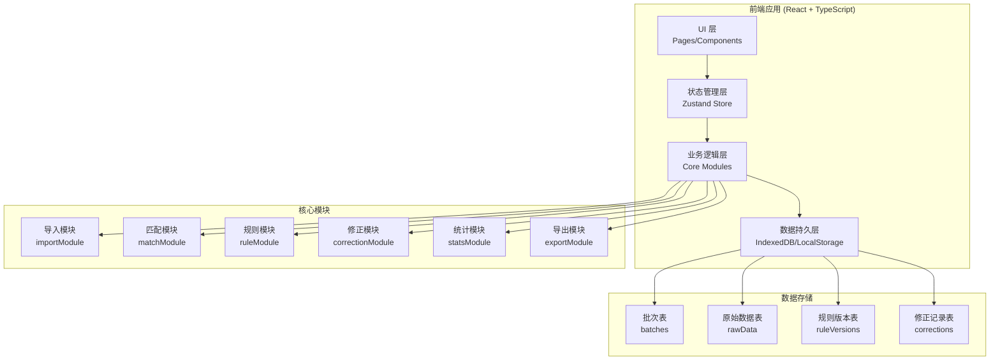
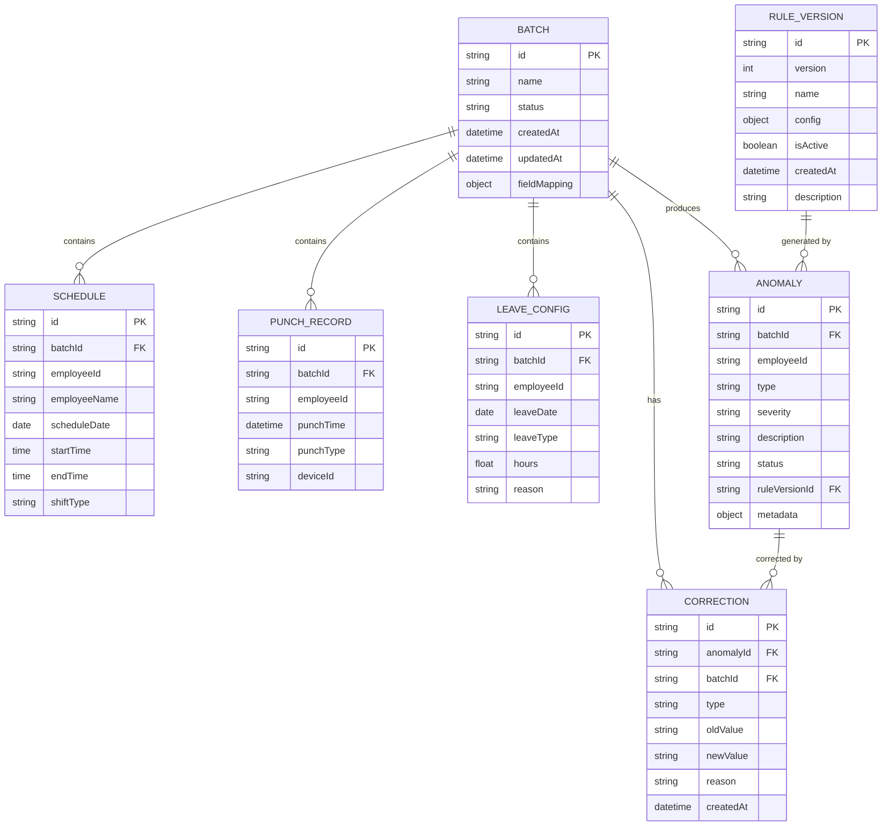

## 1. 架构设计



## 2. 技术描述

- **前端框架**：React@18 + TypeScript + Vite@5
- **状态管理**：Zustand@4
- **路由管理**：React Router DOM@6
- **UI 框架**：TailwindCSS@3 + Lucide React（图标）
- **图表库**：Recharts@2（数据可视化）
- **文件处理**：PapaParse@5（CSV解析）、SheetJS/xlsx@0.18（Excel解析）
- **本地存储**：IndexedDB（idb@7 封装）+ localStorage
- **后端**：无（纯前端应用，所有数据本地持久化）
- **数据库**：IndexedDB 浏览器数据库

## 3. 核心模块目录结构

```
src/
├── modules/              # 核心业务模块
│   ├── import/          # 导入模块
│   ├── match/           # 匹配模块
│   ├── rules/           # 规则引擎
│   ├── correction/      # 修正模块
│   ├── stats/           # 统计模块
│   └── export/          # 导出模块
├── store/               # Zustand 状态管理
├── components/          # 通用组件
├── pages/               # 页面组件
├── utils/               # 工具函数
├── types/               # TypeScript 类型定义
└── db/                  # IndexedDB 封装
```

## 4. 路由定义

| 路由 | 页面名称 | 用途 |
|------|---------|------|
| / | 首页仪表盘 | 数据概览、快速操作、批次入口 |
| /import | 数据导入 | 文件上传、字段映射、数据校验 |
| /analysis | 异常分析 | 异常列表、筛选、人工修正 |
| /rules | 规则配置 | 规则管理、版本历史、回滚 |
| /reports | 统计报告 | 多维度统计、报告生成导出 |
| /batches | 批次管理 | 批次列表、详情查看、管理 |

## 5. 数据模型

### 5.1 数据模型 ER 图



### 5.2 核心类型定义

```typescript
// 批次信息
interface Batch {
  id: string;
  name: string;
  status: 'draft' | 'importing' | 'analyzing' | 'completed' | 'archived';
  createdAt: Date;
  updatedAt: Date;
  fieldMapping: FieldMapping;
  stats: BatchStats;
}

// 字段映射
interface FieldMapping {
  schedule: Record<string, string>;
  punch: Record<string, string>;
  leave: Record<string, string>;
}

// 排班记录
interface ScheduleRecord {
  id: string;
  batchId: string;
  employeeId: string;
  employeeName: string;
  department?: string;
  scheduleDate: string;
  startTime: string;
  endTime: string;
  shiftType: 'normal' | 'night' | 'crossDay';
  breakStartTime?: string;
  breakEndTime?: string;
}

// 打卡记录
interface PunchRecord {
  id: string;
  batchId: string;
  employeeId: string;
  employeeName?: string;
  punchTime: Date;
  punchType: 'in' | 'out' | 'auto';
  deviceId?: string;
  location?: string;
  timezone: string;
}

// 调休配置
interface LeaveRecord {
  id: string;
  batchId: string;
  employeeId: string;
  employeeName?: string;
  leaveDate: string;
  leaveType: 'annual' | 'sick' | 'personal' | 'overtime' | 'other';
  hours: number;
  startTime?: string;
  endTime?: string;
  reason?: string;
}

// 异常类型
type AnomalyType = 
  | 'late'           // 迟到
  | 'early_leave'    // 早退
  | 'missing_punch'  // 缺卡
  | 'cross_day'      // 跨日班次
  | 'duplicate'      // 重复打卡
  | 'leave_offset'   // 调休抵扣
  | 'overtime'       // 加班
  | 'timezone_error' // 时区错误
  | 'no_schedule';   // 无排班

// 异常记录
interface Anomaly {
  id: string;
  batchId: string;
  employeeId: string;
  employeeName?: string;
  department?: string;
  type: AnomalyType;
  severity: 'low' | 'medium' | 'high' | 'critical';
  description: string;
  status: 'pending' | 'corrected' | 'ignored' | 'confirmed';
  ruleVersionId: string;
  scheduleDate: string;
  actualPunchIn?: Date;
  actualPunchOut?: Date;
  scheduledStart?: string;
  scheduledEnd?: string;
  durationMinutes?: number;
  metadata: Record<string, any>;
  createdAt: Date;
  correctedAt?: Date;
  correctionId?: string;
}

// 规则配置
interface RuleConfig {
  id: string;
  name: string;
  description: string;
  enabled: boolean;
  params: Record<string, any>;
}

// 规则版本
interface RuleVersion {
  id: string;
  version: number;
  name: string;
  description: string;
  rules: RuleConfig[];
  isActive: boolean;
  createdAt: Date;
  createdBy: string;
}
```

## 6. 核心模块接口定义

### 6.1 导入模块

```typescript
interface ImportResult<T> {
  success: boolean;
  data: T[];
  errors: ImportError[];
  warnings: string[];
  totalRows: number;
  validRows: number;
}

interface ImportError {
  row: number;
  column: string;
  message: string;
  value: any;
}

interface ImportModule {
  parseCSV(file: File, mapping: FieldMapping): Promise<ImportResult<any>>;
  parseExcel(file: File, mapping: FieldMapping): Promise<ImportResult<any>>;
  validateRequiredFields(data: any[], requiredFields: string[]): ImportError[];
  detectFileType(file: File): 'csv' | 'excel' | 'unknown';
}
```

### 6.2 匹配模块

```typescript
interface MatchResult {
  matched: MatchedRecord[];
  unmatchedSchedules: ScheduleRecord[];
  unmatchedPunches: PunchRecord[];
}

interface MatchedRecord {
  id: string;
  schedule: ScheduleRecord;
  punches: PunchRecord[];
  leave?: LeaveRecord;
  date: string;
  employeeId: string;
}

interface MatchModule {
  matchSchedulesAndPunches(
    schedules: ScheduleRecord[],
    punches: PunchRecord[],
    leaves: LeaveRecord[]
  ): MatchResult;
  findNearestPunch(
    schedule: ScheduleRecord,
    punches: PunchRecord[],
    windowMinutes: number
  ): PunchRecord | null;
  handleCrossDayShift(schedule: ScheduleRecord, punches: PunchRecord[]): PunchRecord[];
}
```

### 6.3 规则模块

```typescript
interface RuleEngineResult {
  anomalies: Anomaly[];
  processedRecords: number;
  ruleVersionId: string;
}

interface RuleModule {
  createRuleVersion(name: string, rules: RuleConfig[], description: string): RuleVersion;
  activateRuleVersion(versionId: string): void;
  rollbackToVersion(versionId: string): RuleVersion;
  getRuleVersions(): RuleVersion[];
  getActiveRuleVersion(): RuleVersion | null;
  runAnomalyDetection(
    matchedRecords: MatchedRecord[],
    ruleVersionId: string
  ): RuleEngineResult;
  detectLateArrival(record: MatchedRecord, params: any): Anomaly | null;
  detectEarlyLeave(record: MatchedRecord, params: any): Anomaly | null;
  detectMissingPunch(record: MatchedRecord, params: any): Anomaly | null;
  detectDuplicatePunches(record: MatchedRecord, params: any): Anomaly | null;
  detectCrossDayShift(record: MatchedRecord, params: any): Anomaly | null;
}
```

### 6.4 修正模块

```typescript
interface CorrectionResult {
  success: boolean;
  anomalyId: string;
  correction: Correction;
}

interface CorrectionModule {
  correctAnomaly(
    anomalyId: string,
    correctionType: string,
    newValue: any,
    reason: string
  ): CorrectionResult;
  batchCorrect(
    anomalyIds: string[],
    correctionType: string,
    newValue: any,
    reason: string
  ): CorrectionResult[];
  ignoreAnomaly(anomalyId: string, reason: string): CorrectionResult;
  confirmAnomaly(anomalyId: string): CorrectionResult;
  getCorrectionHistory(anomalyId: string): Correction[];
}
```

### 6.5 统计模块

```typescript
interface StatsSummary {
  totalRecords: number;
  totalAnomalies: number;
  anomaliesByType: Record<AnomalyType, number>;
  anomaliesBySeverity: Record<string, number>;
  anomaliesByDepartment: Record<string, number>;
  pendingCorrections: number;
  correctedCount: number;
  resolutionRate: number;
}

interface StatsModule {
  calculateSummary(anomalies: Anomaly[]): StatsSummary;
  groupByEmployee(anomalies: Anomaly[]): Record<string, Anomaly[]>;
  groupByDate(anomalies: Anomaly[]): Record<string, Anomaly[]>;
  groupByDepartment(anomalies: Anomaly[]): Record<string, Anomaly[]>;
  calculateTrend(anomalies: Anomaly[], days: number): Array<{ date: string; count: number }>;
}
```

### 6.6 导出模块

```typescript
interface ExportOptions {
  format: 'html' | 'markdown' | 'excel' | 'csv';
  includeCharts?: boolean;
  includeRawData?: boolean;
  includeCorrections?: boolean;
  template?: string;
}

interface ExportModule {
  generateHTMLReport(data: ReportData, options: ExportOptions): string;
  generateMarkdownReport(data: ReportData, options: ExportOptions): string;
  generateExcelReport(data: ReportData, options: ExportOptions): Blob;
  generateCSVReport(data: ReportData, options: ExportOptions): string;
  downloadReport(content: string | Blob, filename: string, format: string): void;
}
```
